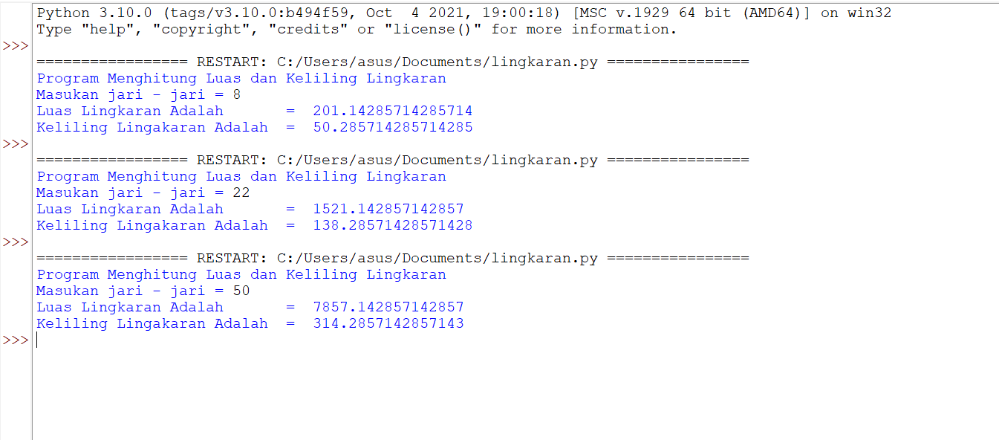

# Lingkaran_py
## Menghitung Luas dan Keliling Lingkaran menggunakan Python
### Berikut rumus L dan K lingkaran 

-Nilai phi yang kita gunakan pada rumus berikut adalah 22/7 , phi adalah sebuah konstanta dalam matematika merupakan perbandingan keliling lingkaran dengan diameter.

-r adalah jari-jari lingkaran 

### Contoh program yang saya buat sebagai berikut 

### Berikut adalah Hasil programnya

### Dan ini adalah flowchart

